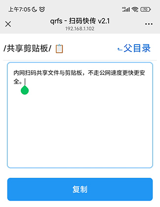

# qrfs - 扫码快传
内网扫码共享文件与剪贴板，不走公网速度更快更安全。

[下载](dist/qrfs.7z) 仅 726 KB。软件非常小，简单方便，传输大文件快如闪电。软件兼容 XP，Vista，Win7，Win8，Win10，Win11 等所有桌面操作系统。

在电脑上运行后，只要把文件或目录拖拽到窗口上就可以共享文件。全局域网都可以通过网页访问，手机扫码就可以打开网页端。 

**不需要在手机上安装任何客户端！**

- 文件上传目录为网站根目录下的 `/upload/` 目录 。
- 手机可在扫码打开的主页点击【共享剪贴板】，也可以选择扫码直接打开【共享剪贴板】，手机端可同步显示电脑端的剪贴板文本，在手机端修改文本也会同步更新电脑剪贴板。 

此软件基于 [aardio](https://www.aardio.com) 标准库中的 wsock.tcp.asynHttpServer  - 由 纯 aardio 代码实现的单线程异步 HTTP 服务端，体积仅数十 KB，可运行 aardio 开发的网站。支持高速上传下载、断点续传、304 缓存、分块传输、Keep Alive。支持共享端口的 HTTP / WebSocket 双服务端（ 由标准库 web.socket.server 实现）。

aardio 标准库中有以下几个 HTTP 服务端库
- wsock.tcp.asynHttpServer 单线程异步服务端。
- wsock.tcp.simpleHttpServer 多线程服务端

这几个 HTTP 服务端都是由纯 aardio 代码实现，可以方便地在桌面软件中实现嵌入式 HTTP 服务端，支持随机端口，可生成独立 EXE 文件，无外部依赖。

aardio 标准库 fastcgi.client 则可以创建支持 IIS 服务器环境的 FastCGI 服务端,。

fastcgi.client , wsock.tcp.asynHttpServer , wsock.tcp.simpleHttpServer 都支持完全相同的网站开发接口。请参考文档：[aardio 语言 Web 服务端开发指南](https://www.aardio.com/zh-cn/doc/guide/quickstart/web-server.html)